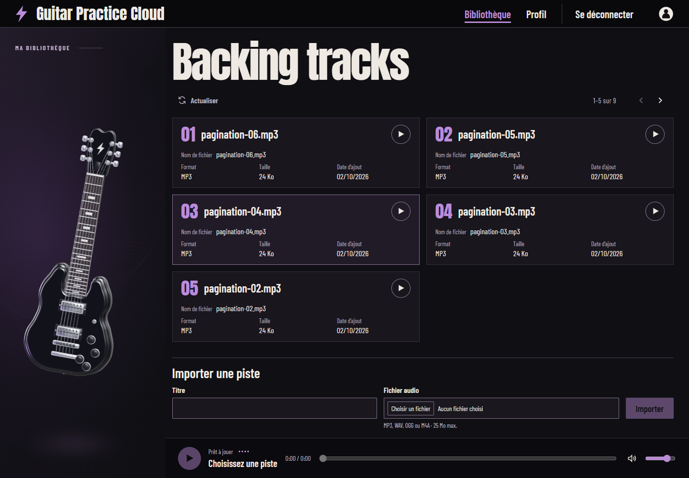

# Guitare 3D — Obsidian

Guitare originale créée dans Blender pour la bibliothèque de Guitar Practice Cloud.

[Vue mobile](previews/guitar-mobile.png)

## Sources

- `blender/obsidian-guitar.blend` : guitare, sept matériaux, caméra et éclairage de studio. La scène initiale est conservée séparément.
- `blender/guitar.py` : reconstruction du modèle, de la scène et export GLB. À exécuter dans le contexte Python de Blender ; le chemin racine est déduit du script.
- `../frontend-starter/public/models/obsidian-guitar.glb` : modèle utilisé par Three.js, environ 1,26 Mo, sept maillages, 26 868 sommets dans Blender.
- `../frontend-starter/public/models/obsidian-guitar.webp` : rendu Blender transparent, environ 42 Ko. Pour le régénérer, ouvrir le fichier Blender puis effectuer le rendu de la caméra et enregistrer avec les paramètres de sortie de la scène.

## Comportement

Perspective au déplacement du pointeur et flottement permanent. Pendant la lecture, l’analyse réelle du son pilote trois effets : les basses font pulser l’éclairage et la guitare ; les médiums déforment six filaments lumineux et accentuent le balancement ; les aigus font scintiller les particules. Les attaques de basses ajoutent une impulsion brève. À l’arrêt du son, ces effets reviennent progressivement au flottement de repos.

Sur ordinateur, la guitare occupe 24 % de la largeur de la page (21,33 % entre 761 et 1100 px). Sur mobile, elle apparaît dans un bandeau au-dessus de la bibliothèque.

L’animation fonctionne sur ordinateur et mobile, sans bouton de suspension ni adaptation à `prefers-reduced-motion`. La boucle de rendu est plafonnée à 30 images/s et suspendue lorsque la scène est hors écran ou l’onglet masqué.

Three.js est chargé séparément. L’image Blender sert de transition pendant le chargement et de secours si WebGL ou le modèle ne sont pas disponibles. La scène graphique et la connexion audio sont libérées à la sortie de la bibliothèque. Les tableaux de fréquences et de positions sont réutilisés à chaque image.

## Vérifications effectuées

- Compilation de production : réussie.
- Trois tests du service audio : réussis (échec de reprise du contexte, réutilisation/libération des connexions, séparation des bandes de fréquences et remise à zéro après pause).
- Chromium, 1440 × 1000 et 390 × 844 : rendu inspecté ; aucune erreur JavaScript observée.
- Connexion avec le compte de démonstration, lecture d’une piste existante et aller-retour Profil/Bibliothèque : vérifiés. Les pistes existantes n’ont pas été modifiées.
- Analyse pendant la lecture : 116 lectures de fréquences, amplitude maximale observée 218/255. Avec la courbe de réponse finale, l’énergie visuelle de la piste de test varie entre 0,255 et 0,268.
- Pause audio : l’énergie visuelle revient à 0,000 après 1,8 seconde et le canvas reste présent.
- Préférence système de réduction des mouvements activée, écran de 390 px : canvas présent, 210 appels de dessin des maillages en 1,1 seconde et aucun débordement horizontal. Aucun bouton de suspension d’animation.
- Perte du contexte WebGL simulée : retour à l’image de secours vérifié.
- Requêtes du modèle, de l’image et de l’API de pistes : réponses 200.

Les captures montrent les données de test déjà présentes. La fluidité sur un téléphone physique et les autres moteurs de navigateur n’ont pas été mesurées.

L’audit npm signale six vulnérabilités dans les dépendances déjà présentes (Angular et outillage). Leurs versions sont identiques à celles du dépôt avant cette intégration ; aucune correction de dépendances hors périmètre n’a été appliquée.
