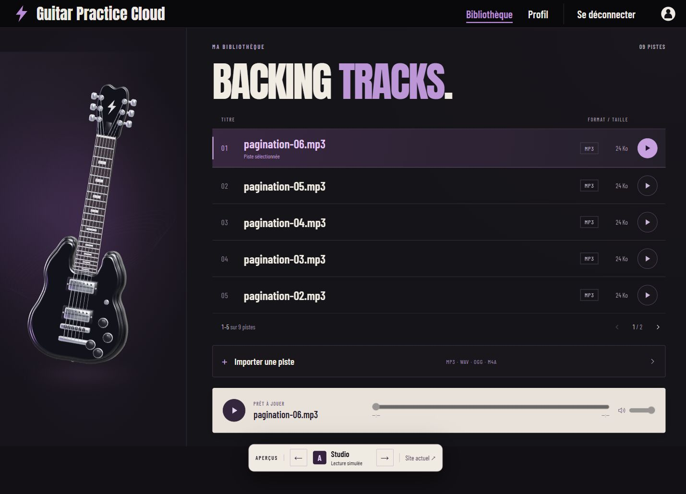
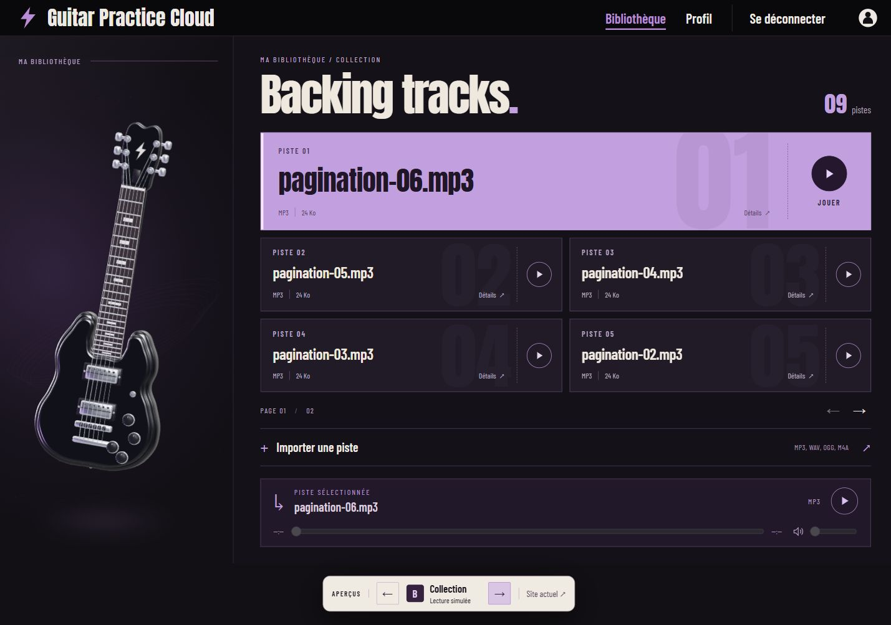
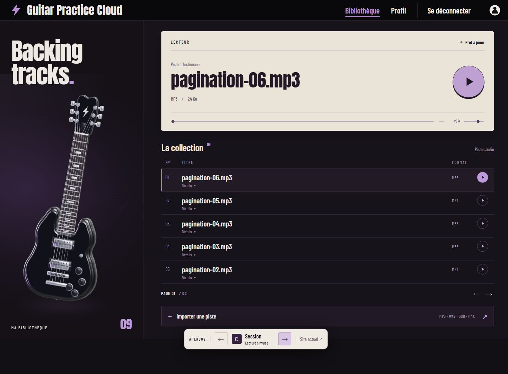

# Propositions pour la bibliothèque

Archive des trois premières explorations. Le thème sombre/violet et la guitare 3D sont conservés.

Le choix porte sur le C de l’esquisse ImageGen : une console sombre. La version ivoire ci-dessous n’a pas été retenue. Les composants de comparaison et leur sélecteur ont été retirés ; le [rendu final](../session/README.md) est intégré à `/tracks`, avec les commandes audio et l’import réels.

## A — Studio

Liste horizontale aérée, typographie bicolore et lecteur ivoire en bas.

## B — Collection

Cartes inspirées de tickets, première piste mise en avant et numéros en arrière-plan.

## C — Session

Lecteur ivoire dominant, titre près de la guitare et liste compacte en dessous.

## État des propositions

Captures des composants Angular avec les données existantes, à une largeur de 1440 px. Les esquisses ImageGen affichées dans la conversation ont servi à explorer les compositions ; les images de ce document montrent le rendu réellement codé.

Les métadonnées proposées dans le TP2 sont facultatives à l'affichage. Les cartes privilégient le titre et la lecture ; les variantes B et C placent le fichier original et la date dans « Détails ».

Ces captures historiques précèdent l’intégration finale.
