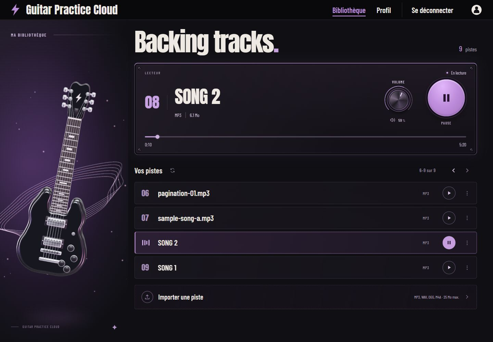

# Bibliothèque — Session

La composition reprend le C sombre de l’esquisse choisie : guitare à gauche, console audio en haut, pistes compactes et import repliable. Ouvrir [la bibliothèque locale](http://127.0.0.1:4200/tracks) après connexion.

[Version mobile, 390 px](session-mobile.jpg)

## Références et choix

- [Guitar Rig](https://www.native-instruments.com/products/guitar-rig-pro) : matière sombre, regroupement des commandes et cadre de rack.
- [Teenage Engineering TP–7](https://teenage.engineering/products/tp-7) : contrôle physique dominant et retour visuel immédiat.
- [Ableton Live](https://www.ableton.com/en/live/) : transport stable, bibliothèque séparée et lecture identifiable.

Les métadonnées de carte suggérées dans le TP2 sont facultatives. La liste garde titre, format et lecture ; fichier original, taille et date se déplient à la demande. Le lecteur affiche les informations du morceau et sa durée réelle. Aucun tempo ou graphique audio fictif n’est ajouté.

## Itérations

La [première passe](iteration-1-desktop.jpg) était trop haute : pagination déplacée près du titre de liste, espaces resserrés et texte superflu retiré. Le volume est devenu un vrai réglage rotatif, avec glissement horizontal ou vertical, clavier et coupure du son séparée. Les temps de lecture ont ensuite été agrandis et espacés du cadre.

Les changements de titre, l’ouverture des détails et la pression des boutons utilisent des transitions courtes. L’indicateur de piste et la lumière du lecteur suivent l’état de lecture réel. Ces nouvelles animations respectent la réduction des mouvements ; la guitare conserve son comportement documenté dans le [document 3D](../README.md).

## Vérifications

- Compilation de production réussie ; neuf tests réussis, dont pagination en échec, requêtes audio concurrentes, refus de lecture et volume.
- Rendu inspecté à 1440 × 1000 et 390 × 844 ; import déplié inspecté sur mobile.
- Lecture, pause, navigation dans le morceau, pagination, volume au clavier et au glissement, coupure puis restauration du niveau : vérifiés sur les pistes existantes.
- Aucun fichier envoyé pendant cette inspection. Les données existantes sont conservées. Les captures montrent leurs titres réels.

Les autres moteurs de navigateur et un téléphone physique n’ont pas été vérifiés.
