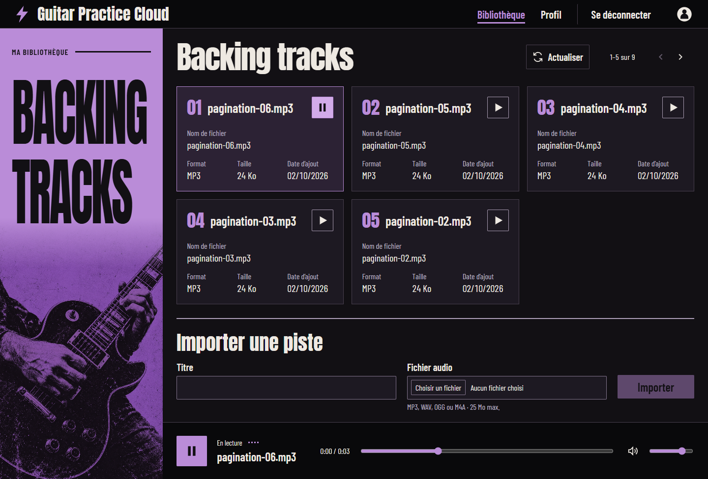

# Démonstration de lecture authentifiée

## Vérification dans Chrome — 2 octobre 2026

1. Après connexion, la bibliothèque a affiché cinq pistes sur neuf.
2. Un clic sur « Lire pagination-06.mp3 » a déclenché `GET /api/tracks/6abf6b264f492e6b84e72d8c/audio` avec le header `Authorization: Bearer …`.
3. Le backend a répondu `200`, avec `Content-Type: audio/mpeg` et `Content-Length: 24540`.
4. Le lecteur a utilisé une URL `blob:` et a affiché « En lecture » avec le titre du morceau. Le temps de lecture a progressé ; la durée détectée était de 3 secondes.

