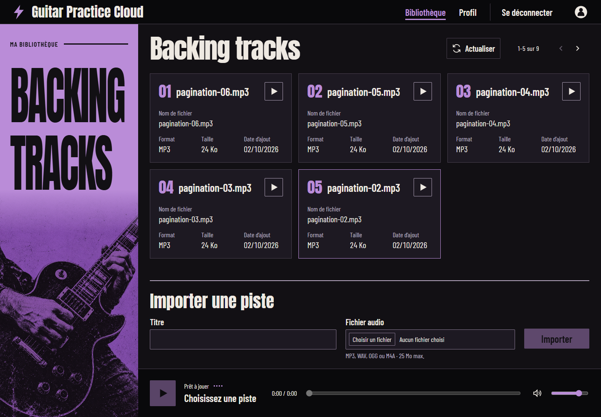
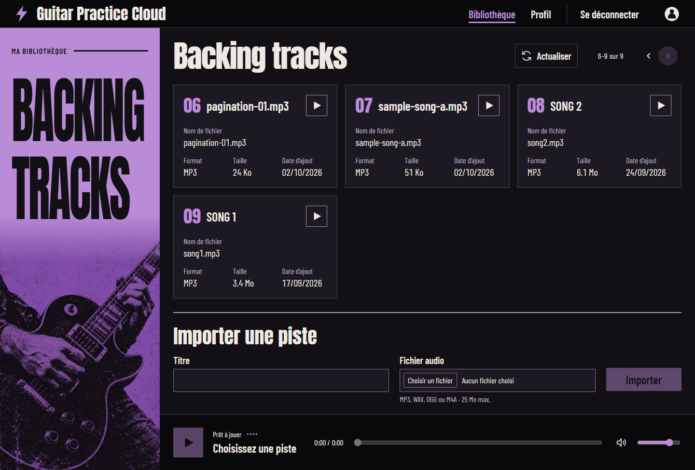
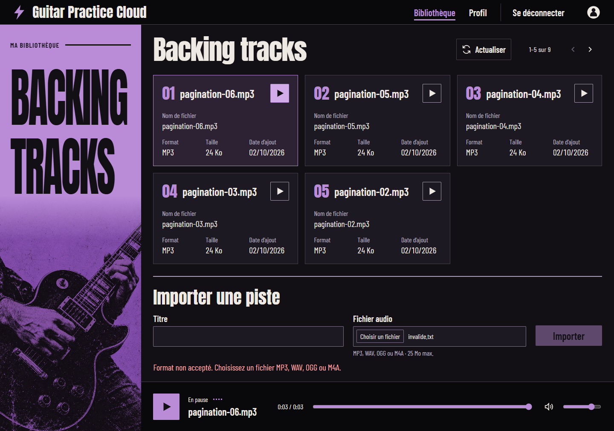
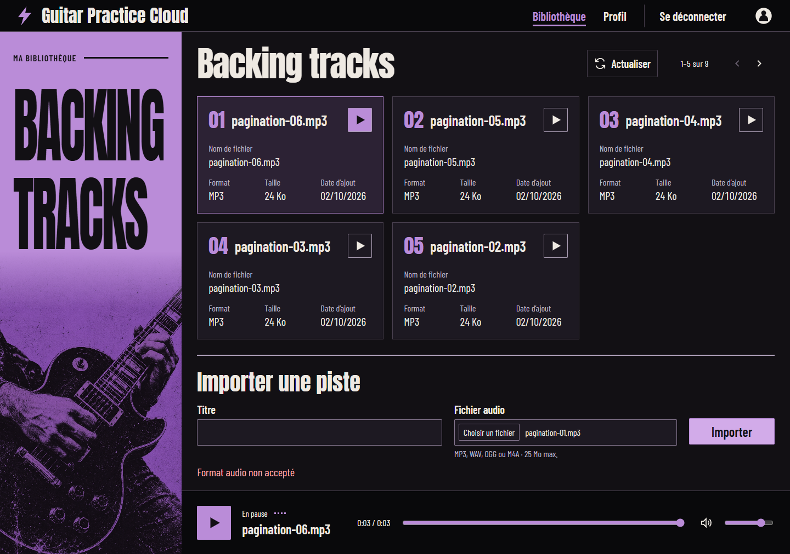
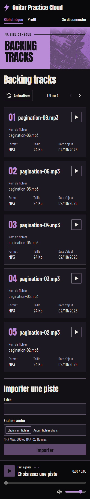
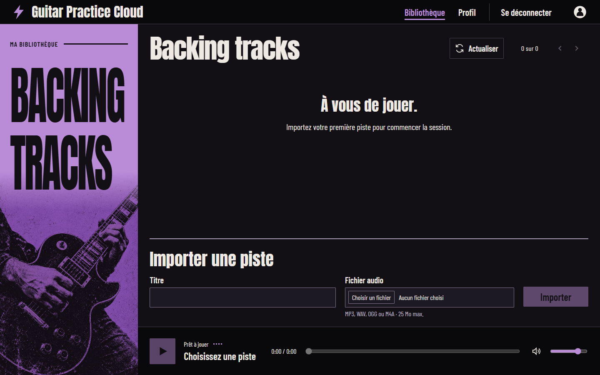
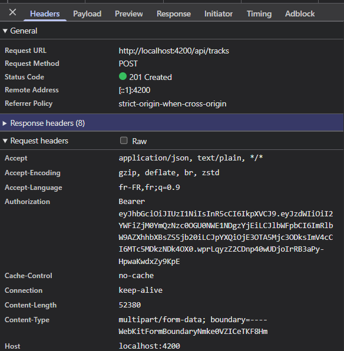
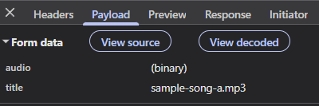

# Relevé HTTP — pagination et validation

## Vérifications dans Chrome — 2 octobre 2026

Les requêtes ont été observées dans Chrome pendant les actions sur `http://localhost:4200`.

| Action | Requête | Statut | Résultat observé |
|---|---|---:|---|
| Ouverture de la bibliothèque | `GET /api/tracks?page=1&limit=5` | 200 | 5 pistes, `total=9`, `pages=2`, affichage « 1–5 sur 9 » |
| Clic sur « Page suivante » | `GET /api/tracks?page=2&limit=5` | 200 | 4 pistes, affichage « 6–9 sur 9 », bouton suivant désactivé |
| Retour à la première page | `GET /api/tracks?page=1&limit=5` | 200 | Première page rechargée |
| Lecture de `pagination-06.mp3` | `GET /api/tracks/6abf6b264f492e6b84e72d8c/audio` | 200 | `audio/mpeg`, 24 540 octets, header `Authorization` présent, lecture active |
| Choix d’un fichier texte | Aucune requête d’upload | — | Message de format invalide et bouton désactivé |
| Upload avec un type MIME invalide, puis nouvel envoi | `POST /api/tracks` | 400 puis 400 | Message affiché ; bouton réactivé après chaque réponse, sans resélection du fichier |
| Lecture de la même piste depuis le deuxième compte | `GET /api/tracks/6abf6b264f492e6b84e72d8c/audio` | 404 | « Piste inconnue » ; accès refusé |

Pour vérifier l’affichage du `400`, un MP3 a été sélectionné, puis le type MIME de la partie multipart `audio` a été remplacé par `text/plain` avant transmission. La réponse provient réellement du backend. Aucune piste n’a été ajoutée par ce test.

Les cards affichent le titre, le nom original, le format, la taille, la date et l’action de lecture. Aucun débordement horizontal à 320, 390, 768 et 1 440 px.

## Test avec le deuxième compte

- Nom : `Test isolation TP2`.
- Email : `tp2-isolation-20261002@example.com`.
- Mot de passe : `TestTp2!2026`.

L’inscription a répondu `201` et ouvert le profil. Après ouverture de la bibliothèque, `GET /api/tracks?page=1&limit=5` a répondu `200` avec `items=[]` et `total=0`. Une requête audio authentifiée avec ce compte vers la piste `pagination-06.mp3` du premier compte a répondu `404`, avec `{"message":"Piste inconnue"}`.

## Captures de l’upload — 2 octobre 2026

Les captures montrent `POST /api/tracks` avec le statut `201 Created`, le header de requête `Content-Type: multipart/form-data; boundary=…` et un formulaire contenant `audio` (binaire) et `title` (`sample-song-a.mp3`).

