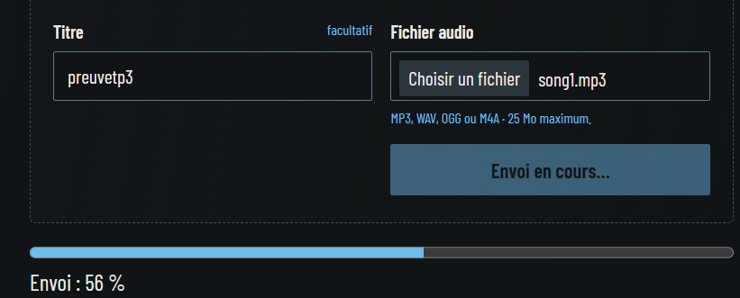
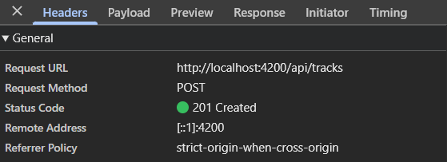
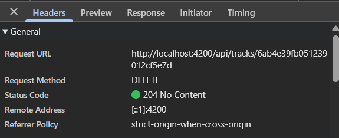
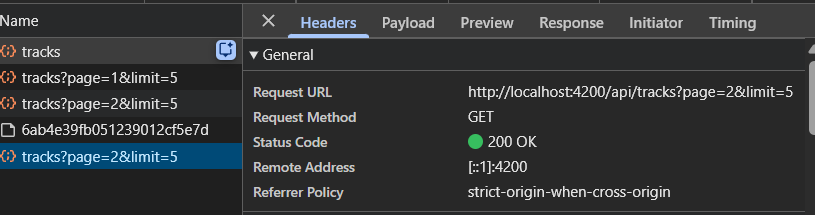
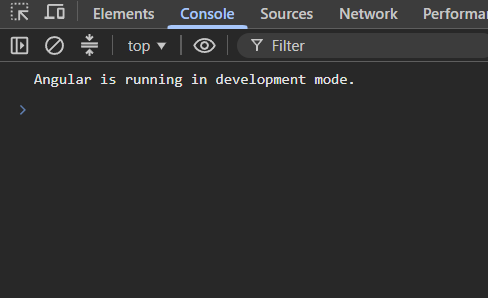

# Rapport des tests — TP3

Vérifications effectuées le 2 octobre 2026.

## Résultats

| Dossier | Commande | Résultat attendu | Résultat observé |
|---|---|---|---|
| `frontend-starter` | `npm test` | Les trois tests demandés passent | 3 tests réussis dans 2 fichiers, aucun échec |
| `backend` | `npm test` | Les tests existants passent | 2 tests réussis, aucun échec |
| `frontend-starter` | `npm run build` | Compilation sans erreur | Build réussi ; sortie dans `dist/gpc` |

La suite frontend contient trois tests parmi ceux proposés par la mission 7. Les tests backend existants sont conservés.

## Tests : résultats attendus et observés

La pagination est testée dans [track.service.spec.ts](../../frontend-starter/src/app/shared/services/track.service.spec.ts). La suppression et l’upload sont testés dans [tracks-page.spec.ts](../../frontend-starter/src/app/components/tracks-page/tracks-page.spec.ts).

| Test | Résultat attendu | Résultat observé |
|---|---|---|
| Pagination HTTP | `list(2, 3)` émet `GET /api/tracks?page=2&limit=3` et transmet la page reçue à l’abonné | Méthode, URL, paramètres et résultat simulé conformes |
| Suppression confirmée | Un seul `DELETE /api/tracks/a` authentifié, bouton désactivé pendant la requête, puis rechargement après `204` | Deuxième suppression bloquée ; nouvelle liste affichée ; compteur mis à jour et succès envoyé au SnackBar |
| Progression et erreur d’upload | `POST /api/tracks` authentifié avec les champs `audio` et `title`, progression affichée, puis message d’erreur et contrôles réactivés après un échec HTTP | Pourcentage à 25 %, double envoi bloqué, erreur `500` affichée et fichier conservé pour réessayer |

## Fonctionnement des tests HTTP

`provideHttpClientTesting()` remplace le transport réseau. `expectOne()` contrôle la requête, `flush()` simule la réponse et `event()` simule la progression. `fixture.detectChanges()` actualise le template pour vérifier les messages et les boutons.

Les tests utilisent le vrai `TrackService` et, pour les requêtes de suppression et d’upload, le vrai intercepteur avec un token fictif. Ils fonctionnent sans backend ni MongoDB.

## Captures de l’upload et de la suppression

## Console

La capture montre uniquement le message normal « Angular is running in development mode. ». Aucune erreur ni donnée sensible n’est visible au moment de la capture.

